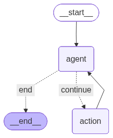
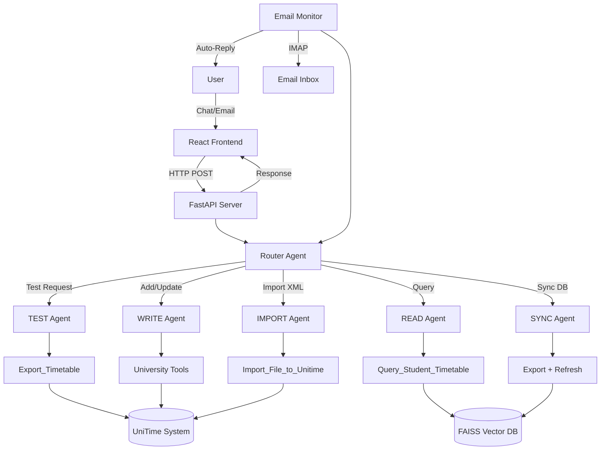
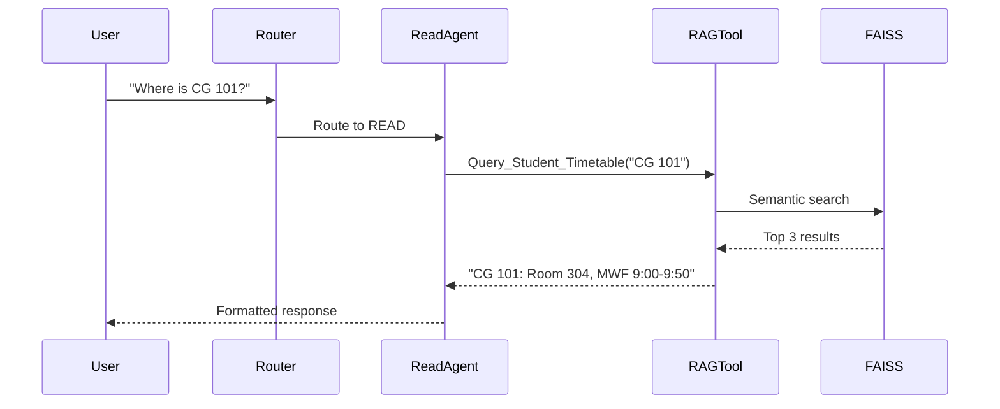
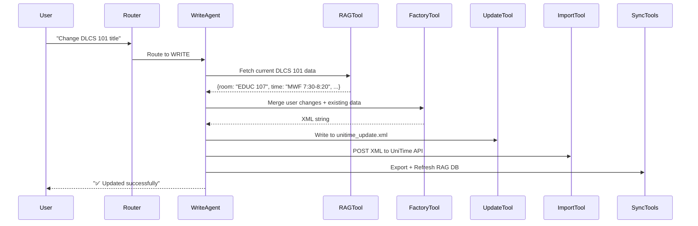
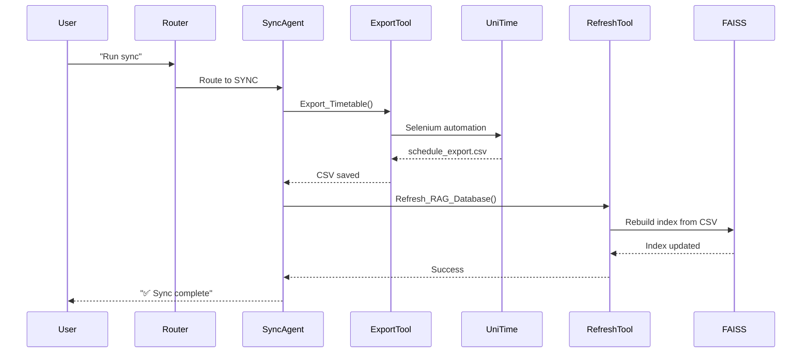
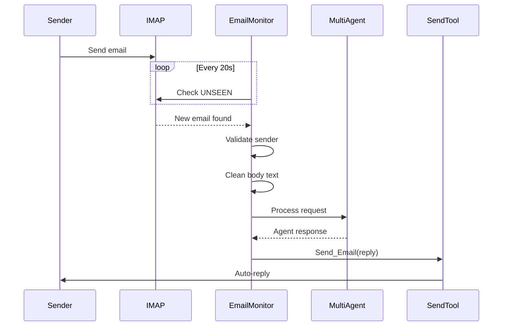

# 🎓 University AI Assistant - Multi-Agent Timetable Management System

[](LICENSE)
[](https://www.python.org/)
[](https://reactjs.org/)
[](https://fastapi.tiangolo.com/)

An intelligent, autonomous multi-agent system for managing university timetables, course offerings, and administrative workflows. Built with **LangGraph**, **LangChain**, and powered by **Krutrim AI** (Qwen3-Next-80B-A3B-Instruct), this system orchestrates specialized agents to handle complex university operations through natural language interactions.



---

## 📋 Table of Contents

- [Overview](#overview)
- [System Architecture](#system-architecture)
- [Core Components](#core-components)
- [Workflow Deep Dive](#workflow-deep-dive)
- [Agent Specifications](#agent-specifications)
- [Technology Stack](#technology-stack)
- [Installation](#installation)
- [Configuration](#configuration)
- [Usage](#usage)
- [API Documentation](#api-documentation)
- [Project Structure](#project-structure)
- [Contributing](#contributing)

---

## 🌟 Overview

The University AI Assistant is a **production-ready multi-agent orchestration system** designed to automate and streamline university timetable management. It combines:

- **5 Specialized Agents**: TEST, READ, WRITE, SYNC, and IMPORT agents, each with domain-specific expertise
- **Intelligent Routing**: LangGraph-powered router that directs queries to the appropriate agent
- **RAG-Powered Chatbot**: Vector database (FAISS) for semantic search over course schedules
- **Email Automation**: Background email monitor that processes requests and auto-responds
- **Web Interface**: Modern React dashboard with dark mode, real-time agent status, and tool execution logs
- **UniTime Integration**: Direct API integration with UniTime course management system

### Key Features

✅ **Natural Language Course Management**: Add, update, or query courses using plain English
✅ **Automated Email Processing**: Monitors inbox and processes course requests automatically
✅ **Selenium-Based Export**: Automated timetable export from UniTime web interface
✅ **Context-Aware Updates**: Fetches existing course data before modifications to preserve integrity
✅ **Multi-Format Support**: Handles batch imports, individual updates, and preference management
✅ **Real-Time Sync**: Automatic database refresh after modifications
✅ **Secure Authentication**: Role-based access with whitelisted email senders

---

## 🏗️ System Architecture

### High-Level Architecture



### Component Interaction Flow

1. **Input Layer**: User interacts via React frontend or sends email
2. **API Layer**: FastAPI server receives requests and manages email monitoring
3. **Orchestration Layer**: LangGraph router analyzes intent and routes to specialized agent
4. **Agent Layer**: Specialized agents execute domain-specific workflows
5. **Tool Layer**: Agents invoke tools (Selenium, RAG, XML generation, API calls)
6. **Data Layer**: UniTime database, FAISS vector store, CSV exports

---

## 🧩 Core Components

### 1. Multi-Agent Orchestration (`multi_agent.py` / `kurt_multi_agent.py`)

**Purpose**: Central orchestration system using LangGraph state machines

**Key Features**:

- **Router Agent**: Analyzes user intent and routes to appropriate workflow
- **State Management**: Maintains conversation history and agent context
- **Tool Binding**: Dynamically binds tools to agents based on workflow
- **Error Handling**: Graceful fallbacks and retry mechanisms

**Agent Routing Logic**:

```python
# Router decides based on keywords and intent
TEST    → "test export", "test selenium"
READ    → "where is", "what time", "who teaches"
WRITE   → "add", "update", "modify", "process email"
SYNC    → "run sync", "refresh database"
IMPORT  → "import batch", "push to unitime"
```

### 2. Backend Toolkits

#### 📧 Email Toolkit (`Backend/Tools/email/`)

- **Read_Email**: Fetches unread emails via IMAP
- **Send_Email**: Sends automated responses via SMTP

#### 🎓 University Toolkit (`Backend/Tools/university/`)

- **Add_Offering_to_Batch_File**: Generates XML for new course offerings
- **Update_Course_File**: Creates XML for course modifications
- **Add_Preference_to_Batch**: Handles instructor/room preferences
- **Model_Prompt_Factory**: Converts natural language to structured XML
- **Import_File_to_Unitime**: Pushes XML to UniTime API

#### 🤖 Auto-Sync Toolkit (`Backend/Tools/Auto_sync/`)

- **Export_Timetable**: Selenium bot that logs into UniTime and exports CSV

#### 🔍 RAG Toolkit (`Backend/Tools/rag_system/`)

- **Query_Student_Timetable**: Semantic search over course schedules
- **Refresh_RAG_Database**: Rebuilds FAISS index from latest CSV export

### 3. FastAPI Server (`api/server.py`)

**Endpoints**:

- `GET /`: Health check
- `POST /chat`: Main chat endpoint with conversation history

**Features**:

- **Async Streaming**: Uses `astream()` for non-blocking agent execution
- **CORS Enabled**: Allows frontend connections
- **Lifespan Management**: Starts email monitor on startup
- **Model Singleton**: Lazy-loads NLP models to reduce memory footprint

### 4. Email Monitor Service (`Backend/Services/email_monitor.py`)

**Purpose**: Background service that monitors inbox and auto-processes requests

**Workflow**:

1. Polls IMAP inbox every 20 seconds
2. Filters emails from whitelisted senders
3. Extracts clean body text (removes signatures, quotes)
4. Invokes multi-agent system with email content
5. Sends automated reply with agent's response

**Security**:

- Whitelist-based sender validation
- Sanitizes email content
- Runs in isolated async task

### 5. React Frontend (`frontend/src/App.js`)

**Features**:

- **Agent Status Indicator**: Real-time display of active agent
- **Tool Execution Logs**: Shows which tools were invoked
- **Dark Mode**: Persistent theme toggle
- **Demo Mode**: Fallback when backend is unavailable
- **Quick Actions**: Pre-configured queries for common tasks
- **Typewriter Effect**: Smooth message rendering

---

## 🔄 Workflow Deep Dive

### Workflow 1: READ (Student Query)

**Trigger**: "Where is my CG 101 class?"



**Technical Details**:

- Uses `sentence-transformers` for embedding generation
- FAISS index stores course metadata (room, time, instructor)
- Returns top-k results with similarity scores

### Workflow 2: WRITE (Course Update)

**Trigger**: "Change title of DLCS 101 to 'Advanced AI'"



**Key Logic**:

- **Context Preservation**: Fetches existing data before updates
- **Disambiguation**: Asks user if multiple courses match
- **Validation**: Checks if course exists before modification
- **Auto-Sync**: Always refreshes RAG database after changes

### Workflow 3: SYNC (Database Refresh)

**Trigger**: "Run the full auto-sync"



**Technical Details**:

- Uses `selenium` + `webdriver-manager` for browser automation
- Logs into UniTime with credentials from `.env`
- Downloads CSV export to `schedule_export.csv`
- Parses CSV and generates embeddings for each course
- Stores in FAISS index at `faiss_index/`

### Workflow 4: EMAIL AUTOMATION

**Trigger**: Email received from whitelisted sender



**Security Features**:

- Whitelist validation (`ALLOWED_SENDERS`)
- Email content sanitization
- Removes quoted replies and signatures

---

## 🤖 Agent Specifications

### 1. TEST Agent 🧪

**Purpose**: Validate Selenium export functionality

**Tools**: `Export_Timetable`

**Prompt Strategy**:

```
When user says "test export":
1. Call Export_Timetable tool
2. Report success/failure
```

**Use Cases**:

- Pre-deployment testing
- Debugging export issues
- Verifying UniTime connectivity

---

### 2. READ Agent 📖

**Purpose**: Answer student queries about schedules

**Tools**: `Query_Student_Timetable`

**Prompt Strategy**:

```
You are a timetable assistant. Use Query_Student_Timetable 
to answer questions about class times, locations, instructors.
Be accurate and concise.
```

**Use Cases**:

- "Where is my CS 101 class?"
- "Who teaches Data Structures?"
- "What time is DLCS 102?"

---

### 3. WRITE Agent ✍️

**Purpose**: Modify course data with context awareness

**Tools**:

- `Add_Offering_to_Batch_File`
- `Update_Course_File`
- `Add_Preference_to_Batch`
- `Query_Student_Timetable`
- `Model_Prompt_Factory`
- `Import_File_to_Unitime`
- `Export_Timetable`
- `Refresh_RAG_Database`

**Prompt Strategy**:

```
WORKFLOW 1: UPDATING A COURSE
1. FETCH: Call Query_Student_Timetable for current data
2. MERGE: Combine existing data + user changes
3. FORMAT: Call Model_Prompt_Factory to generate XML
4. EXECUTE: Call Update_Course_File
5. IMPORT: Push to UniTime
6. SYNC: Refresh RAG database

WORKFLOW 2: ADDING DATA
- New course → Add_Offering_to_Batch_File
- Preference → Add_Preference_to_Batch
```

**Use Cases**:

- "Add CS 4500 on MWF 10:00-10:50 in Room 201"
- "Update DLCS 101 title to 'Machine Learning'"
- "Instructor Doe needs a projector"

---

### 4. SYNC Agent 🔄

**Purpose**: Maintain RAG database freshness

**Tools**: `Export_Timetable`, `Refresh_RAG_Database`

**Prompt Strategy**:

```
1. Call Export_Timetable (Selenium bot)
2. AFTER success, call Refresh_RAG_Database
3. Report completion
```

**Use Cases**:

- "Run the full auto-sync"
- "Refresh the database"
- "Update the chatbot"

---

### 5. IMPORT Agent 📥

**Purpose**: Push XML files to UniTime

**Tools**: `Import_File_to_Unitime`

**Prompt Strategy**:

```
If user says "import batch" → filename='unitime_batch.xml'
If user says "import update" → filename='unitime_update.xml'
If user says "import preferences" → filename='unitime_preferences.xml'
```

**Use Cases**:

- "Import the batch file"
- "Push changes to UniTime"
- "Apply the updates"

---

## 🛠️ Technology Stack

### Backend

| Technology                      | Purpose                                    |
| ------------------------------- | ------------------------------------------ |
| **Python 3.8+**           | Core language                              |
| **LangChain**             | LLM orchestration framework                |
| **LangGraph**             | State machine for multi-agent workflows    |
| **Krutrim AI**            | LLM provider (Qwen3-Next-80B-A3B-Instruct) |
| **FastAPI**               | Async web framework                        |
| **Uvicorn**               | ASGI server                                |
| **Selenium**              | Browser automation for exports             |
| **FAISS**                 | Vector database for semantic search        |
| **Sentence-Transformers** | Embedding generation                       |
| **Pandas**                | CSV processing                             |
| **IMAPClient**            | Email retrieval                            |
| **Requests**              | HTTP client for UniTime API                |

### Frontend

| Technology             | Purpose               |
| ---------------------- | --------------------- |
| **React 18**     | UI framework          |
| **Lucide Icons** | Icon library          |
| **Tailwind CSS** | Utility-first styling |

### External Systems

- **UniTime**: Course management system
- **Gmail/IMAP**: Email integration

---

## 📦 Installation

### Prerequisites

- Python 3.8 or higher
- Node.js 16+ and npm
- Chrome/Chromium browser (for Selenium)
- UniTime instance (local or remote)

### Backend Setup

```bash
# Clone repository
git clone https://github.com/yourusername/My_Agentic_Ai.git
cd My_Agentic_Ai

# Create virtual environment
python -m venv venv
source venv/bin/activate  # On Windows: venv\Scripts\activate

# Install dependencies
pip install -r requirements.txt

# Download ChromeDriver (handled automatically by webdriver-manager)
```

### Frontend Setup

```bash
cd frontend
npm install
```

---

## ⚙️ Configuration

### Environment Variables

Create a `.env` file in the project root:

```env
# === LLM Configuration ===
KRUTRIM_API_KEY=your_krutrim_api_key_here

# === UniTime Configuration ===
UNITIME_API_URL=http://localhost:8080/UniTime/api/xml
UNITIME_USERNAME=admin
UNITIME_PASSWORD=your_password
EXPORT_BASE_URL=http://localhost:8080/UniTime

# === Email Configuration ===
EMAIL_ADDRESS=your_email@gmail.com
EMAIL_PASSWORD=your_app_password
EMAIL_IMAP_SERVER=imap.gmail.com
EMAIL_SMTP_HOST=smtp.gmail.com
EMAIL_SMTP_PORT=587
EMAIL_DRAFT_MODE=false
EMAIL_DRAFT_FOLDER=Drafts

# === Model Paths ===
BASE_MODEL_ID=google/flan-t5-base
OFFERING_MODEL_PATH=./term_important/offering_model
PREFERENCE_MODEL_PATH=./term_important/preference_model

# === File Paths ===
SCHEDULE_EXPORT_PATH=./schedule_export.csv
RAG_INDEX_PATH=./faiss_index
```

### Email Whitelist

Edit `Backend/Services/email_monitor.py`:

```python
ALLOWED_SENDERS = {
    "admin@university.edu",
    "registrar@university.edu"
}
```

---

## 🚀 Usage

### Starting the System

#### 1. Start Backend Server

```bash
# Option 1: Using run.py
python run.py

# Option 2: Direct uvicorn
uvicorn api.server:app --host 127.0.0.1 --port 8000 --reload
```

Server will start at `http://localhost:8000`

#### 2. Start Frontend

```bash
cd frontend
npm start
```

Frontend will open at `http://localhost:3000`

### Command-Line Interface

You can also run the multi-agent system directly:

```bash
python multi_agent.py
```

**Example Interactions**:

```
> Where is my CG 101 class?
[Router] Routing to: READ
--- [read_agent]: Calling 1 tool(s)...
--- [Tool Result: Query_Student_Timetable]: CG 101 meets in Room 304, MWF 9:00-9:50

> Add a new offering: CS 4500, Data Mining, MWF 10:00-10:50, Room 201
[Router] Routing to: WRITE
--- [write_agent]: Calling 1 tool(s)...
--- [Tool Result: Add_Offering_to_Batch_File]: Successfully added to unitime_batch.xml

> Run the full auto-sync now
[Router] Routing to: SYNC
--- [sync_agent]: Calling 2 tool(s)...
--- [Tool Result: Export_Timetable]: CSV exported successfully
--- [Tool Result: Refresh_RAG_Database]: Database refreshed with 150 courses
```

### Web Interface

1. Navigate to `http://localhost:3000`
2. Use quick actions or type queries
3. Monitor agent status in header
4. View tool execution logs in message bubbles
5. Toggle dark mode with moon/sun icon

### Email Automation

1. Send email to configured address from whitelisted sender
2. Subject: "Course Request"
3. Body: "Add CS 101, Introduction to Programming, MWF 9:00-9:50, Room 101"
4. System auto-processes and replies within 20 seconds

---

## 📡 API Documentation

### POST `/chat`

Process a chat message through the multi-agent system.

**Request Body**:

```json
{
  "message": "Where is my CG 101 class?",
  "history": [
    {"role": "user", "content": "Hello"},
    {"role": "bot", "content": "Hi! How can I help?"}
  ]
}
```

**Response**:

```json
{
  "response": "CG 101 meets in Room 304, MWF 9:00-9:50",
  "agent": "READ",
  "tool_calls": ["Query_Student_Timetable"]
}
```

**Status Codes**:

- `200`: Success
- `500`: Server error

---

## 📁 Project Structure

```
My_Agentic_Ai/
├── Backend/
│   ├── Agents/
│   │   └── email_agents/          # Email-specific agents
│   ├── Tools/
│   │   ├── email/                 # Email toolkit (Read, Send)
│   │   ├── university/            # University toolkit (Add, Update, Import)
│   │   ├── Auto_sync/             # Selenium export tool
│   │   └── rag_system/            # RAG query and refresh tools
│   ├── Services/
│   │   ├── email_monitor.py       # Background email processor
│   │   └── model_singleton.py     # Lazy model loader
│   ├── Helper/
│   │   ├── imap_email.py          # IMAP utilities
│   │   └── read_email_helper.py   # Email parsing
│   ├── tool_framework/            # Base classes for tools/toolkits
│   └── types/                     # Type definitions
├── api/
│   └── server.py                  # FastAPI application
├── frontend/
│   ├── src/
│   │   ├── App.js                 # Main React component
│   │   └── index.js               # Entry point
│   └── package.json
├── data/                          # Training data for NLP models
├── term_important/                # Fine-tuned models
├── multi_agent.py                 # Multi-agent orchestrator (Google Gemini)
├── kurt_multi_agent.py            # Multi-agent orchestrator (Krutrim)
├── run.py                         # Server launcher
├── requirements.txt               # Python dependencies
├── schedule_export.csv            # Latest timetable export
├── unitime_batch.xml              # Batch course additions
├── unitime_update.xml             # Course modifications
└── README.md                      # This file
```

---

## 🤝 Contributing

Contributions are welcome! Please follow these guidelines:

1. Fork the repository
2. Create a feature branch (`git checkout -b feature/amazing-feature`)
3. Commit changes (`git commit -m 'Add amazing feature'`)
4. Push to branch (`git push origin feature/amazing-feature`)
5. Open a Pull Request

---

## 📄 License

This project is licensed under the Apache License 2.0 - see the [LICENSE](LICENSE) file for details.

---

## 🙏 Acknowledgments

- **LangChain** for the orchestration framework
- **LangGraph** for state machine capabilities
- **Krutrim AI** for LLM inference
- **UniTime** for course management system
- **FAISS** for efficient vector search

---

## 📞 Support

For issues, questions, or feature requests, please open an issue on GitHub.

---

**Built with ❤️ for modern university administration**
